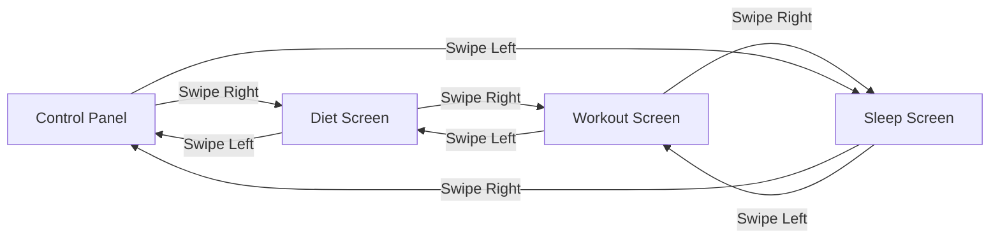

# Meridian: Detailed Product & Architectural Report

> [!IMPORTANT]
> **Product Philosophy: The Convergence of Three Pillars**
> During the historic 2007 Macworld keynote, Steve Jobs introduced the iPhone by building suspense around three separate products: a widescreen iPod with touch controls, a revolutionary mobile phone, and a breakthrough Internet communicator. He repeated them until the audience realized the core breakthrough: *"These are not three separate devices. This is one device, and we are calling it iPhone."*
> 
> **Meridian** is built on this exact convergence philosophy. 
> 
> Historically, users track fitness through three separate, disconnected systems: a calorie/diet logger, a workout planner, and a sleep tracker. These are treated as separate apps, separate notifications, and separate data silos. **Meridian is not three separate apps; it is one unified daily loop.** Diet, workout, and sleep are integrated into a single, cohesive experience anchored by a central emotional and behavioral metric: the **Momentum Ring**.

---

## 1. Executive Summary & Design Philosophy

Meridian is a production-ready, personal-use fitness application built in Flutter. The app rejects the industry trend of gamified clutter, cartoonish animations, and guilt-based notifications. Instead, it adopts a **dark HUD cockpit aesthetic** (near-black background, glowing thin-stroke indicators, and restrained premium animations) inspired by Teenage Engineering, Whoop, and Things 3.

Every design choice in Meridian is backed by psychological and cognitive neuroscience principles to minimize friction, support user autonomy, and build lasting habits.

---

## 2. Core Architectural Framework & Navigation (The Loop)

Meridian is structured around a horizontal, bidirectional, infinite looping layout:



### Key Navigation Mechanics
*   **The Infinite PageView:** Implemented using a custom, high-cardinality `PageView` (`initialPage = 5000`) and mapping the active index to screens via `index % 4`. This lets users swipe backward or forward endlessly without hitting a navigation boundary.
*   **Proprioceptive Dot Indicator:** A bottom-center progress dot bar that continuously morphs. The active screen's dot expands into a pill shape (20×8px) and shifts color to match the screen's accent (Blue for Control Panel, Amber for Diet, Green for Workout, Indigo for Sleep) driven directly by the scroll offset of the `PageController`.
*   **Cognitive Rationale (Hick's Law):** By using a fixed loop instead of tab bars or drawer menus, the app minimizes decision-making overhead. Users always know they are only a swipe away from any other section.

---

## 3. The Momentum Ring: Emotional & Psychological Anchor

The **Momentum Ring** ([momentum_ring.dart](file:///home/abhijith/Desktop/Nine%20Tails/lib/core/widgets/calorie_ring.dart)) is the central dashboard metric on the Control Panel. It synthesizes a user's entire day into a single score.

```
       .---.
     /       \     <- Green Progress Arc (driven by Diet, Workout, Water)
    |    85%  |
     \       /     <- Red Gaps Arc (representing remaining daily goals)
       '---'
```

### Psychological Design Decisions

1.  **Loss Aversion (Kahneman & Tversky):** The ring features a dual-arc layout. A green "progress" arc actively eats into a red "gaps" arc. Rather than just showing empty space, the explicit red gap represents a loss, which behaviorally motivates completion more effectively than a standard blank track.
2.  **Goal-Gradient Effect (Kivetz et al.):** Motivation increases as a goal approaches. Meridian mirrors this by changing the ring's visual behavior non-linearly:
    *   **< 50% Progress:** Static ring, standard glow.
    *   **50% - 85% Progress:** Outer glow pulses subtly (±5% opacity over a 2.5s loop).
    *   **≥ 85% Progress:** Glow pulse accelerates (±12% opacity over a 1.2s loop) and the stroke brightens by 8% to reflect accelerating motivation.
3.  **Variable Rewards (Dopamine Maintenance):** To prevent habituation, reaching 1.0 (100% completion) triggers one of **5 distinct completion animations** chosen at random:
    *   *Variant 1:* Radial diffusion glow + two-note chime.
    *   *Variant 2:* White-hot color easing to green + medium haptic impact.
    *   *Variant 3:* Shimmer/sweep effect around the ring stroke + soft chime.
    *   *Variant 4:* Center text bounce scale (1.0 → 1.08 → 1.0) + glow pulse.
    *   *Variant 5:* A brief full-ring color flash (300ms) to a lighter green tint.

---

## 4. Key Functional Modules

### 4.1. Control Panel (Daily Overview)
*   **Weekly Strip:** Row of 7 mini-rings showing past completion status. The current day is highlighted using the `blueGlow` color.
*   **Water Tracker:** Features a single "+ " button that instantly logs the default container size (typically 500ml) with **zero confirmation steps** (minimizing ability-cost). Long-pressing the "+" opens an alternative size selector.
*   **"Next Up" Card:** Prompting implementation intentions ("Leg Day — 6:00 PM"). Tapping the card redirects the user directly to the relevant screen.

### 4.2. Diet Screen
*   **Predefined Mode:** Fixed meal slots (Breakfast, Lunch, Dinner, Snack) containing target calorie/macronutrient bounds. Cards are completed via checkmarks.
*   **Custom Mode:** Activated by a toggle, removing strict targets (which can cause guilt on unstructured days) and replacing them with an estimation mode. Tapping "+" slides up a quick-add bottom sheet.
*   **AI Estimation Stub:** A quick-add parser that estimates calories based on meal descriptions (e.g., "Chicken Salad" -> ~400 kcal) with code hooks ready for LLM integration.

### 4.3. Workout Screen
*   **Recovery/Readiness Score:** An index calculated from sleep quality that adjusts workout difficulty.
*   **Exercise Cards:** Designed with large tap targets for use with sweaty hands. Checked exercises recede visually (dimming text) to draw attention to remaining work.
*   **Workout Session Mode:** A dedicated modal view (replaces the page loop) displaying a single exercise at a time with giant controls (56×56px targets) and an integrated rest timer.

### 4.4. Sleep Screen
*   **Morning Contrast Adjustments:** High contrast and large font sizes (44px) are used to combat wake-up grogginess.
*   **Autonomy-Supportive Framing:** Sleep summaries avoid shame-based language. It states "Your recovery capacity is reduced" rather than "You failed to sleep enough."
*   **Segmented Stage Bar:** A horizontal bar illustrating Light, REM, Deep, and Awake times, animating with staggered ease-in sweeps on load.

---

## 5. Design Tokens & Ergonomic Guidelines

### Color Palette

| Token Name | Hex Value | Primary Purpose |
| :--- | :--- | :--- |
| `bg` | `#090B0F` | Main application background |
| `bgCard` | `#111420` | Primary container card background |
| `bgCardLight`| `#1A1E28` | Secondary/active cards and sheet background |
| `green` | `#3DDC9E` | Workout screens, completion states, success |
| `red` | `#E85F52` | Gaps, warning states |
| `amber` | `#F59E3D` | Diet progress and calories |
| `blueGlow` | `#4FD1FF` | Water tracker, active states, Control Panel accents |
| `purple` | `#9E8CFA` | Fat macro bar |
| `indigo` | `#5966E6` | Sleep screen indicators and cards |
| `white` | `#F5F7FA` | Primary high-contrast text |
| `gray` | `#8A94A6` | Secondary body text |

### Interaction Design Standards
*   **Fitts's Law Placement:** High-frequency logging buttons are positioned within the lower two-thirds of the display (the "thumb-zone"). Low-frequency/high-risk actions, like the logout button, are placed at the far top-right avatar menu.
*   **Animation Consistency (`AppMotion`):**
    *   Progress changes: `600ms` via `Curves.easeInOutCubic` (applies to macro bars, calorie ring, and momentum ring).
    *   Sheet slides: `250ms` via `Curves.easeOutCubic`.
    *   Toggles: `150ms` via `Curves.easeOut`.
*   **Haptic Feedback Tiers:**
    *   `HapticFeedback.selectionClick()`: Toggles and switches.
    *   `HapticFeedback.lightImpact()`: Incremental updates (water, logging standard items).
    *   `HapticFeedback.mediumImpact()`: Major tasks finished (exercise completed, ring target filled).

---

## 6. Codebase File Structure Map

*   [main.dart](file:///home/abhijith/Desktop/Nine%20Tails/lib/main.dart) - Entry point, Riverpod initialization, App theme configuration.
*   [navigation_shell.dart](file:///home/abhijith/Desktop/Nine%20Tails/lib/features/navigation_shell.dart) - The loop manager, active theme swapper, and Account overlay sliding menu.
*   **Core Shared Components:**
    *   [AppColors](file:///home/abhijith/Desktop/Nine%20Tails/lib/core/theme/colors.dart) - Hex color token mappings.
    *   [AppMotion](file:///home/abhijith/Desktop/Nine%20Tails/lib/core/theme/motion.dart) - Standard animation curves and durations.
*   **Features:**
    *   `control_panel/` - Home screen, momentum ring painter, water tracking, weekly strips.
    *   `diet/` - Predefined/custom view switch, quick add sheets, and macro progress bars.
    *   `workout/` - Exercise lists, session mode routes, and countdown timers.
    *   `sleep/` - Wake-up screen, segmented sleep stage bar, sleep score color tiers.
*   **Data Layer:**
    *   [models.dart](file:///home/abhijith/Desktop/Nine%20Tails/lib/data/models/models.dart) - Pure data schemas (`Meal`, `ExerciseLog`, `SleepLog`, `UserProfile`).
    *   `repositories/` - Local SQL/Hive repositories.
    *   `providers/` - Riverpod state notifier wrappers.
